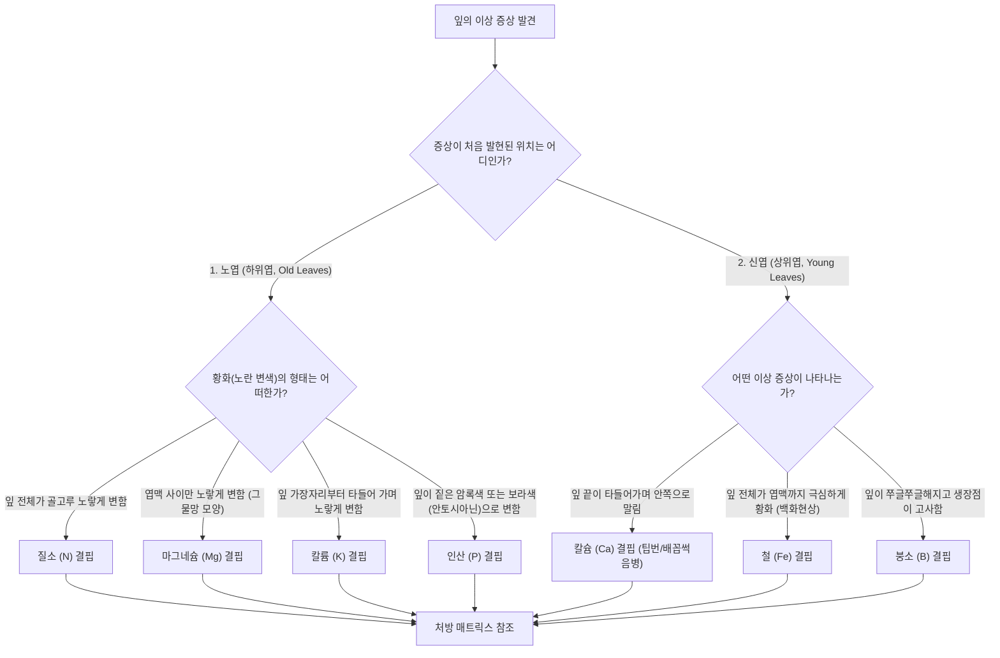
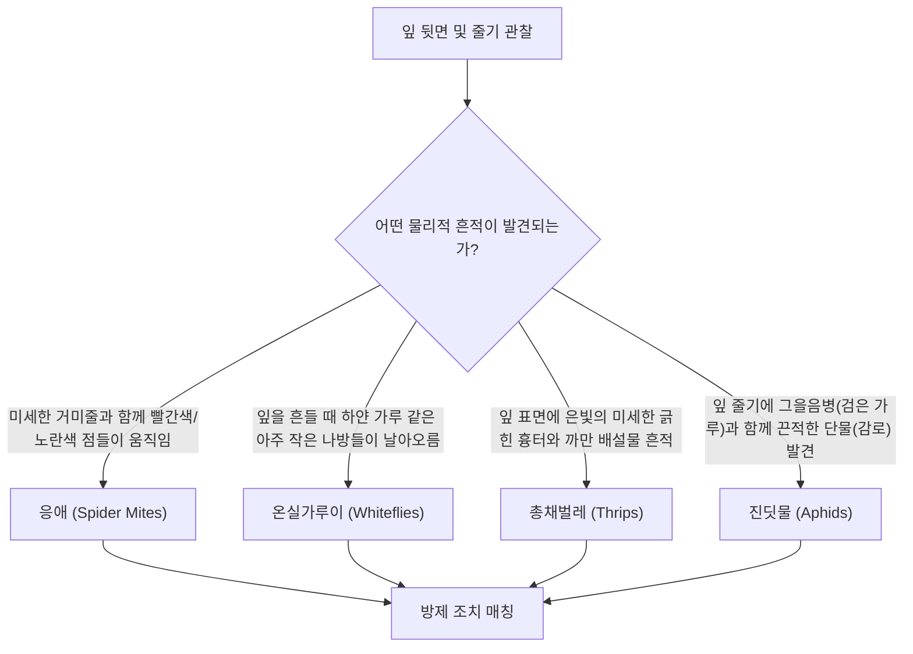

# 🐛 Interactive Crop Diagnoser: Leaf Symptom Decision Tree & Treatment Matrix

본 문서는 원예 스마트 온실 또는 홈가드닝에서 발생하는 작물(특히 토마토, 파프리카)의 잎 이상 증상을 판별하기 위한 **의사결정 나무(Decision Tree) 흐름도**와 영양 결핍 및 주요 병해충에 대한 **방제 처방 매트릭스** 기술 규격서입니다.

이 기획안은 향후 `inwoovation.com`에 연동할 작물 자가진단 인터랙티브 웹앱의 핵심 알고리즘 데이터베이스로 사용됩니다.

---

## 🌿 1. 잎 이상 증상 진단 의사결정 나무 (Diagnostic Decision Tree)

식물 잎의 이상 증상은 발현 위치(노엽 vs 신엽)와 황화(Chlorosis) 패턴을 통해 영양소 이동성에 따른 결핍 요소를 정밀 판별할 수 있습니다.

---

## 🐛 2. 해충 및 물리적 흔적 진단 트리 (Pest Diagnostic Tree)

육안 및 돋보기로 관찰되는 해충 피해 흔적 진단 경로입니다.

---

## 💊 3. 영양 결핍 및 해충 방제 처방 매트릭스 (Treatment Matrix)

진단된 각 원인별 독일 BVL 규격 및 한국 친환경 농자재 표준 처방 가이드라인입니다.

### 1) 영양소 결핍 처방

| 결핍 원소 | 처방 화학식 (Fertilizer) | 조치 방법 (Foliar/Fertigation) |
| :--- | :--- | :--- |
| **질소 (N)** | $NH_4NO_3$ (질산암모늄) / Urea (요소) | 양액 내 질소 농도 $150 \text{ ppm}$으로 증량 또는 요소 $0.2\%$ 엽면시비 |
| **마그네슘 (Mg)**| $MgSO_4\cdot7H_2O$ (황산마그네슘) | 황산마그네슘 $1\%$~2% 수용액을 엽면살포 (기온이 낮은 아침에 실시) |
| **칼륨 (K)** | $KNO_3$ (질산칼륨) / $K_2SO_4$ (황산칼륨) | 과실肥大期에 칼륨 대 질소 비율을 $1.5 : 1$ 이상으로 상향 조절 |
| **칼슘 (Ca)** | $Ca(NO_3)_2$ (질산칼슘) | 질산칼슘 $0.3\%$ 엽면살포 + 온실 VPD를 $0.8$~$1.2 \text{ kPa}$로 유지하여 증산 촉진 |
| **철 (Fe)** | Fe-EDTA / Fe-DTPA (킬레이트 철) | 배지 pH가 $6.5$ 이상으로 상승 시 철 흡수 장애 발생 -> 양액 pH $5.8$ 제어 |

### 2) 친환경 생물학적 방제 (Biological Pest Control)

독일 원예 현장에서 주로 사용하는 천적 곤충 매칭 정보입니다.

| 대상 해충 (Pest) | 천적 생물 (Beneficial Insects) | 방제 메커니즘 |
| :--- | :--- | :--- |
| **응애 (Spider Mites)** | *Phytoseiulus persimilis* (칠레이리응애) | 응애 성충 및 알을 직접 포식 (습도 $60\%$ 이상에서 활성화) |
| **온실가루이 (Whiteflies)**| *Encarsia formosa* (온실가루이좀벌) | 가루이 유충 몸속에 산란하여 기생 박멸 (일조량 확보 필수) |
| **총채벌레 (Thrips)** | *Amblyseius swirskii* (스비르스키이리응애) | 총채벌레 1령충 포식 및 가루이 알 병행 방제 |
| **진딧물 (Aphids)** | *Aphidius colemani* (콜레마니진디벌) | 진딧물 몸속에 산란하여 '머미(Mummy)'로 만들어 사멸 유도 |
