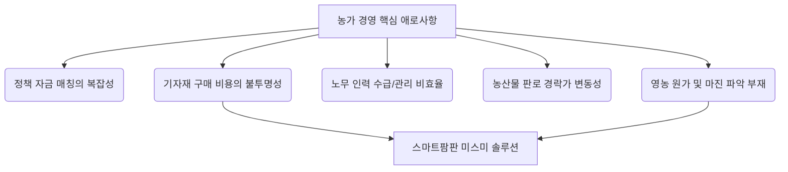

# 💡 [Pipeline Draft] 스마트팜판 미스미 (Agri-Automation procurement Platform)

본 문서는 스마트팜 정밀 계산기 대시보드 프로젝트의 장기 확장 파이프라인으로 구상된 **"농기자재 및 정밀 하드웨어 B2B 카탈로그 플랫폼(스마트팜판 미스미)"**의 비즈니스 모델 설계안 초안입니다.

---

## 1. 핵심 가치 제안 (Value Proposition)
공업용 공장자동화 표준 기계부품 플랫폼인 **미스미(MISUMI)**의 핵심 원리를 농업에 이식합니다.

* **표준화 (Standardization)**: 시설하우스 및 스마트팜 규격(하우스 파이프 조인트, 모터 커플러, 솔레노이드 밸브 등)의 치수 조합별 자재 표준 규격화.
* **가격 투명성 (Price Transparency)**: 오프라인 딜러 및 농자재상의 불투명한 견적 구조를 깨뜨리는 즉시 온라인 단가 노출 및 배송 일정 공개.
* **엔지니어링 데이터 (Ag-Specs)**: 설계 하중, 재질 강도, 도면(3D CAD) 제공으로 정밀 온실 설계 가능화.
* **계산기 연동 결제 (Calculator-to-Cart)**: VPD, 밸브 규격, 열손실량 계산을 마친 후 호환되는 표준 자재를 즉시 추천 및 결제 유도.

---

## 2. 농가 경영의 5대 페인 포인트 연계



1. **지자체/정부 지원금 및 정책자금 매칭**: 
   - 지원금 수급 요건과 필요한 표준 시설 기자재 견적을 플랫폼에서 연동하여 정책자금 신청에 필요한 자재 견적서 자동 산출.
2. **기자재 유통 원가 절감 (미스미 타겟)**: 
   - 유통마진이 붙어 파편화된 동네 자재상 대신 직수입 및 다이렉트 OEM 공급을 통해 농가의 고정비(CAPEX) 30% 이상 절감.
3. **노무/인력 수급**: 
   - 시공 시 지역 일당 인부 세무 노무 일괄 정산 및 수급 시스템 연동.
4. **유통 판로 연동**: 
   - 계약 재배 농가 그룹에 필수 자재 및 정량 비료 성분(Fertigation) 패키지를 일괄 선공급하여 생산량 및 규격을 공산품 수준으로 안정화.
5. **원가 관리**: 
   - 경영 장부와 부품 구매 카탈로그 연동. 기계 수명 및 보수 주기(MTBF)에 따른 예비 소모품 자동 조달.

---

## 3. 핵심 비즈니스 로드맵

```
[Phase 1: 신뢰 구축 및 리드 마그넷]
  - 정밀 공학 계산기 (VPD, Kv 밸브, 열손실, 증산량) 배포 (배포 완료)
  - 글로벌 사용자 트래픽 획득 및 사용자 요구 분석
        ▼
[Phase 2: 자재 추천 및 파트너십 유통]
  - 계산기 하단에 호환 규격 부품(예: Kv 16 규격 3-Way 밸브) 추천 링크 추가
  - 제조사/수입사 파트너 제휴를 통한 제휴 마케팅 수수료 획득
        ▼
[Phase 3: 스마트팜 미스미 브랜드 (PB) 구축]
  - 가장 회전율이 빠르고 규격화가 쉬운 소모성 하드웨어 자재 직소싱/PB 생산
  - 3D CAD 도면 및 견적 간소화 소프트웨어(SaaS) 공급
```

---

## 4. 농업인 요구사항 심화 연구 주제 (Global Search Target)
* 지역별 온실 구경 표준 차이 분석 (한국 ㎡/평/하우스파이프 규격 vs 북미 sq ft/인치 규격)
* 작물 생리 모델(VPD, Evapotranspiration)과 물/비료 공급 펌프 하드웨어 규격 최적화 매칭 알고리즘 연구
* 소형 컨테이너형 식물공장 DIY 조립식 프레임 및 제어 시스템 패키지(BOM Kit) 표준화 방안
